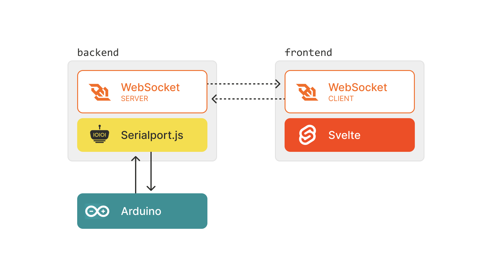

### Setup

    npm install

### Develop

    npm run dev

### Build

    npm run build

# Hardware Interaction (Hardware communication)

Diese Beispiele zeigen wie eine Kommunikation zwischen einem Microcontroller und App stattfinden kann.
Dabei wird die **Serialport-library** zur Kommunikation mit dem Controller und **Websocket** zur Kommunikation zwischen frontend und backend genutzt.

## Serialport

### Software

`Serialport.js` ist eine Library zur seriellen Kommunikation. Seriel bedeutet, dass einzelne Bits nacheinander übertragen werden.

    import { SerialPort } from "serialport";
    const port = new SerialPort({ path: devicePort, baudRate: 9600 });

Um aus Bits die am Port ankommen eine Nachricht zu machen, wird er mit einem **parser** veknüpft. Der liest bis zu einem Umbruch und wandelt die Daten zu einer lesbaren Nachricht um.

    import { ReadlineParser } from "serialport";

    let parser = port.pipe(new ReadlineParser());

Da der serielle Port nur auf Clientseite existiert, führen wir den Prozess auf dem Client aus. Über einen **WebSocket** werden die Daten dann an das frontend geschickt.

- [SerialPort Docs](https://serialport.io/docs/)

### Hardware

Auf Seite des Arduinos lesen und schreiben wir über die serielle Schnittstelle

    String inputString;

    void setup() {
        Serial.begin(9600);
    }
    void loop() {
        //Empfangen:
        while (Serial.available()) {
            inputString = Serial.readStringUntil('\n');
        }

        //Senden
        Serial.println("Hello from Arduino");
    }

---

## WebSocket

WebSocket ist ein Netzwerkprotokoll, das eine Verbindung zwischen **Webanwendung** (Client) und einem **WebSocket-Server** ermöglicht.

- [ws-library Docs](https://github.com/websockets/ws)
- [WebSocket Wikipedia](https://de.wikipedia.org/wiki/WebSocket)

### Server

Um den Server zu erstellen, verwenden wir die `ws-library`.

    import { WebSocketServer } from "ws";
    const wss = new WebSocketServer({ port: 8080 });

**Senden:** Dieser Server sendet in unserem Fall, jedes mal wenn am Port eine Nachricht ankommt, diese an den Client weiter.

    parser.on("data", (data) => {
        if (websocketClient !== undefined) {
            websocketClient.send(JSON.stringify({ connected: true, message: data }));
        }
    });

**Empfangen:** Wenn der Server eine Nachricht vom Client bekommt, wird diese an den Port geschrieben.

    ws.on("message", function message(data) {
            if (port) port.write(data + "\n");
    });

### Client

Auf Clientseite nutzen wir das JS-native WebSocket Objekt

    let socket = new WebSocket('ws://localhost:8080')

**Empfangen:**

    socket.addEventListener('message', (event) => {
        const data = JSON.parse(event.data);
        //do something with the data
    }

**Senden:**

    socket.send(light);
